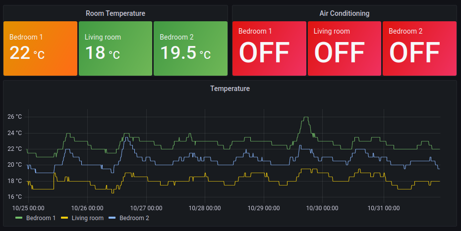

# melcloud-exporter 

__melcloud-exporter__ is a Prometheus exporter for a MELCloud data. It currently
only exports a very limited set of metrics: the device's power state, the target
temperature and the current temperature sensor reading.

I hear you asking: "Wait so this guy is using his air conditioning units to
monitor temperature in his house?". Well yes, yes I am:

## Metrics

This service exports the following metrics:

| Name                                 | Labels                                          | Type  |
|------------------------------------- |-------------------------------------------------|-------|
| __melcloud_device_power__            | ``building_id``, ``device_id``, ``device_name`` | gauge |
| __melcloud_device_temperature_room__ | ``building_id``, ``device_id``, ``device_name`` | gauge |
| __melcloud_device_temperature_set__  | ``building_id``, ``device_id``, ``device_name`` | gauge |
